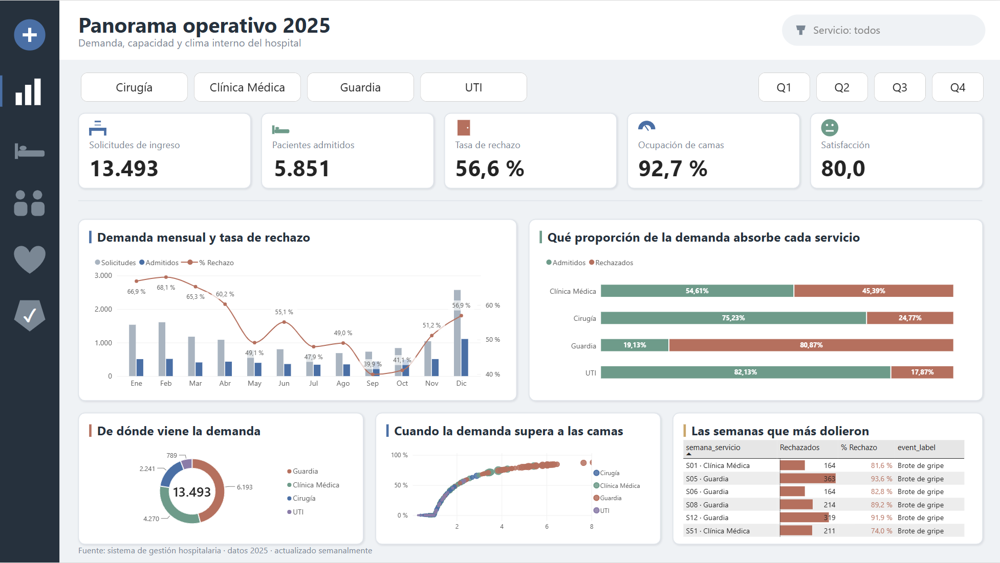

# Análisis operativo de un hospital

Proyecto de análisis de datos de punta a punta sobre la operación de un hospital durante 2025:
limpieza en Python, modelo dimensional en SQL Server y tablero en Power BI.

Arranqué con cuatro CSV sueltos que no cruzaban entre sí y terminé con un modelo estrella de seis
dimensiones y tres tablas de hechos. La parte interesante no fue el tablero, fue darme cuenta de
que uno de los archivos estaba roto y decidir qué hacer con eso.



## Los datos

| Archivo | Filas | Grano | Contenido |
|---|---|---|---|
| `patients.csv` | 1.000 | Una internación | Fechas de ingreso y egreso, edad, servicio, satisfacción |
| `services_weekly.csv` | 208 | Semana × servicio | Camas, solicitudes, admisiones, rechazos, moral, eventos |
| `staff.csv` | 110 | Un agente | Rol y servicio de cada persona |
| `staff_schedule.csv` | 6.552 | Semana × agente | Presencia semanal durante 52 semanas |

## Los tres problemas que aparecieron

**Las claves del personal no cruzaban.** Cero coincidencias entre `staff_schedule.staff_id` y
`staff.staff_id` sobre 6.552 filas. Reconstruí la clave foránea usando el nombre como clave
natural, que sí cruza para 110 de las 126 personas de la agenda.

**Hay 16 personas en la agenda que no existen en el maestro.** Sus nombres son los primeros 16 del
archivo de pacientes, todas cargadas como enfermería de UTI. Es contaminación del generador de
datos. Las 832 filas van a un archivo de cuarentena en lugar de desaparecer sin dejar rastro.

**Hay 17 semanas con el hospital entero ausente.** Una de cada tres, con las 110 personas en
`present = 0`. Sin filtrarlas el ausentismo del año da 40%; filtrándolas da 10,8%. Preferí
marcarlas con una bandera antes que borrarlas, así el dato original queda trazable.

Rol y servicio de la agenda también contradicen al maestro en 3.744 y 1.924 filas. La regla fue
simple: la agenda es un hecho, el maestro es la dimensión, gana el maestro.

## Lo que salió del análisis

El hospital rechazó el 56,6% de las solicitudes de ingreso del año. No es un problema de personal,
es un problema de camas.

- **Guardia es el cuello de botella.** Concentra el 46% de la demanda y rechaza al 80,9%. Sus camas
  estuvieron al 100% de ocupación todo el año. En UTI el rechazo es del 17,9%.
- **Los brotes de gripe duplican el rechazo.** 65,7% en las semanas con brote contra 31,9% en las
  normales, y la demanda promedio pasa de 56 a 161 solicitudes.
- **Los paros pegan en el clima, no en la capacidad.** La moral cae 19,4 puntos, pero el rechazo
  baja porque la demanda también cae.
- **El ausentismo no explica los rechazos.** Partí el año en cuartiles de ausentismo semanal y la
  tasa de rechazo no sigue ninguna tendencia. Lo que predice el rechazo es la presión de demanda
  sobre las camas disponibles.
- **Diciembre concentró el 19% de la demanda anual**, con un crecimiento del 147% contra noviembre.

## Cómo está armado

```
CSV crudos  →  ETL en Python  →  CSV limpios  →  SQL Server  →  Power BI
                                       ↓
                              dq_report + cuarentena
```

```
├── data/                    los 4 CSV originales
├── etl/etl_hospital.py      limpieza, modelo estrella y 32 controles de calidad
├── sql/                     esquema, carga y 10 consultas analíticas
└── powerbi/                 tablero, medidas DAX y captura
```

El ETL corre en Google Colab sin instalar nada. Ejecuta 32 controles de calidad y escribe once
CSV limpios, cada control registrado con las filas afectadas y la decisión tomada.

El modelo tiene tres tablas de hechos con granos distintos que comparten dimensiones:
internaciones a nivel paciente, operación a nivel semana por servicio, y asistencia a nivel semana
por agente. Las dos dimensiones de tiempo están deliberadamente desconectadas entre sí para no
armar un ciclo.

## Cómo correrlo

```bash
pip install pandas numpy
python etl/etl_hospital.py
```

En Colab: subir los cuatro CSV a `/content`, pegar el script en una celda y ejecutar.

Después, en SSMS: `01_schema.sql`, `02_load.sql` (ajustando la ruta de los CSV) y
`03_analysis.sql`. Las consultas usan `LAG` para la variación mensual, `NTILE` para los cuartiles
de ausentismo, `DENSE_RANK` para el ranking de semanas críticas y frames `ROWS BETWEEN` para la
media móvil y el acumulado.

El `.pbix` levanta los CSV que genera el ETL. Si se mueven de lugar hay que actualizar la ruta en
Transformar datos → Configuración del origen de datos.

## Decisiones que tomé

Podría haber cruzado las cuatro tablas en una sola tabla ancha. No lo hice porque los granos son
incompatibles: 1.000 internaciones no se reconcilian con 5.851 admisiones semanales, y mezclarlas
produce números que parecen correctos y no lo son.

Las bandas de edad, estadía y satisfacción están calculadas en el ETL y no en DAX. Son reglas de
negocio estables y prefiero que vivan en un solo lugar, versionado.

El campo `event` está a nivel semana por servicio, no a nivel semana. Tardé un rato en darme
cuenta, y cambia el análisis: una misma semana puede tener brote de gripe en Cirugía y nada en
Guardia.

## Limitaciones

Los datos son sintéticos y se nota. La satisfacción del archivo de pacientes no correlaciona con
la del archivo semanal y no hay forma de reconciliar las admisiones semanales con las
internaciones individuales. El análisis trata cada tabla de hechos por separado y evita
conclusiones que crucen esos dos mundos.

Tampoco hay costos, diagnósticos ni reingresos. Lo que hay alcanza para un análisis de capacidad
y de flujo.

## Stack

Python 3.11 con pandas y numpy · SQL Server 2019 · Power BI Desktop · Google Colab
